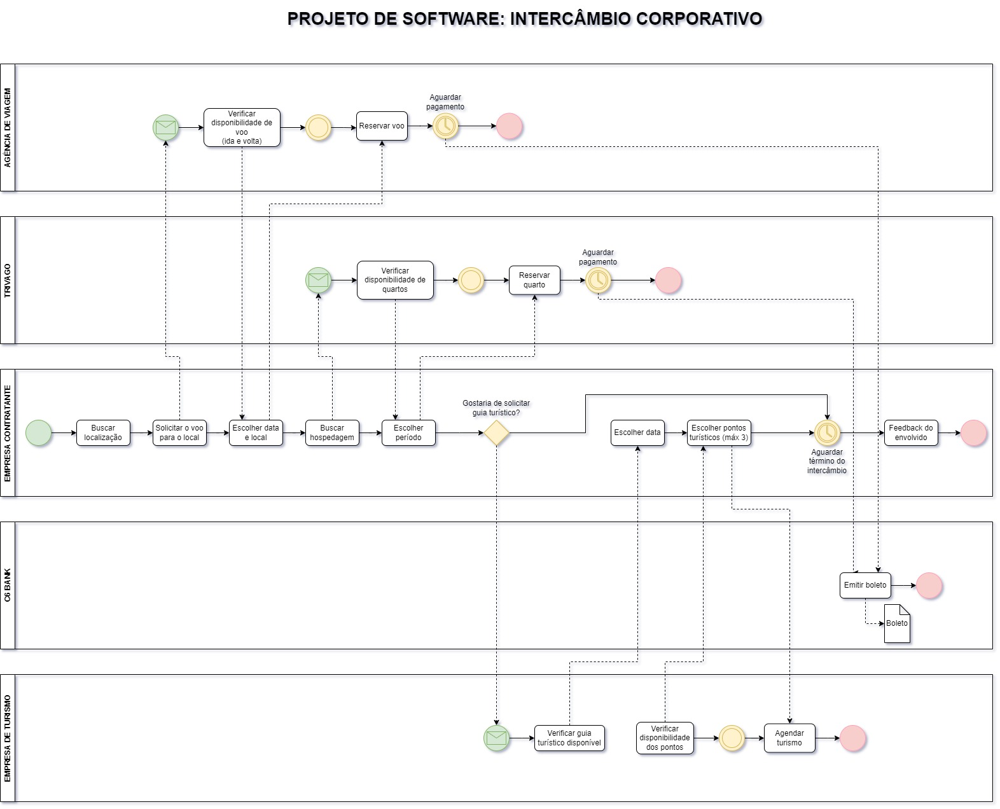

# -------------------------------- INTERCÂMBIO CORPORATIVO --------------------------------

  O negócio proposto pelo grupo consiste em otimizar o processo de Intercâmbio de um colaborador requisitado pela empresa, a fim de estudar, trabalhar e obter conhecimento em alguma outra filial ou parceira e adquirir novas tecnologias para o crescimento da empresa em questão.

--> Descrição dos projetos:
    A empresa assumirá a responsabilidade de estabelecer contato com as diversas agências de viagem, hospedagem e turismo envolvidas no processo, com o objetivo de centralizar as negociações e simplificar as etapas a serem cumpridas pelo cliente. Desta forma, espera-se que o contratante precise apenas definir um único ponto para efetuar o pagamento e receber um cronograma consolidado, contendo todas as informações relevantes para a realização do intercâmbio.

--> Fluxograma do projeto:
    

--> Processos separados:

    1 em processo...
    2 em processo...
    3 em processo...
    4 em processo...
    5 em processo...
    
