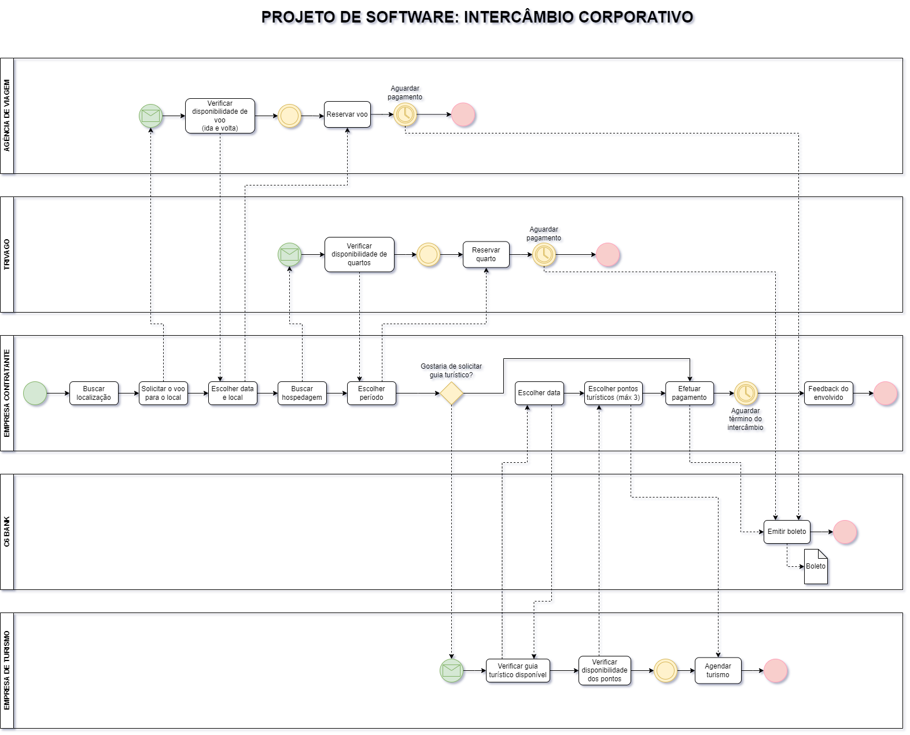
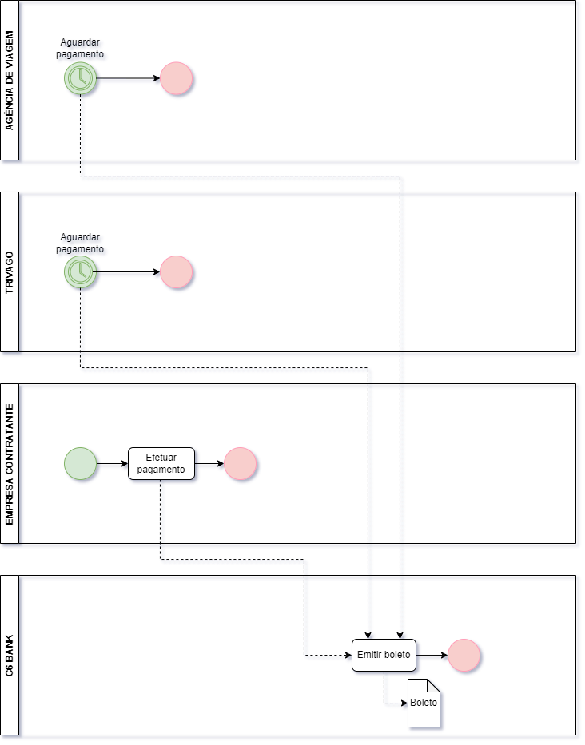
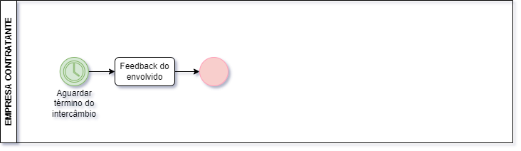
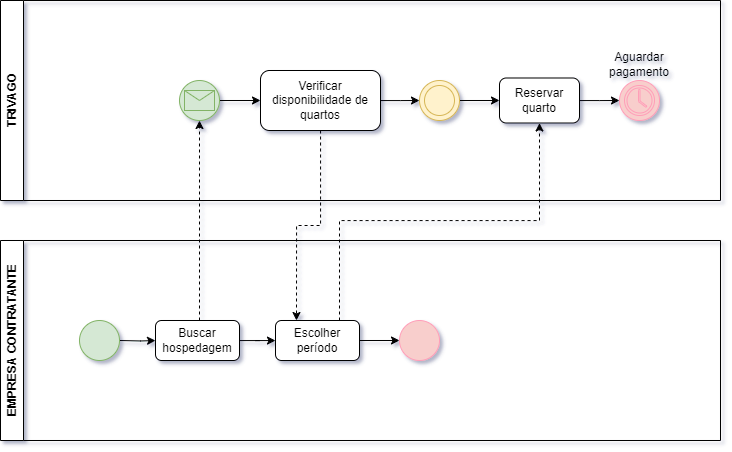
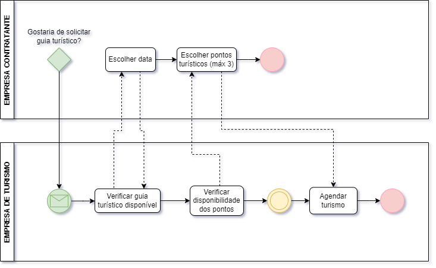
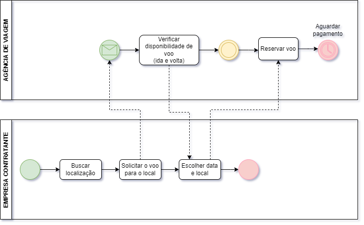
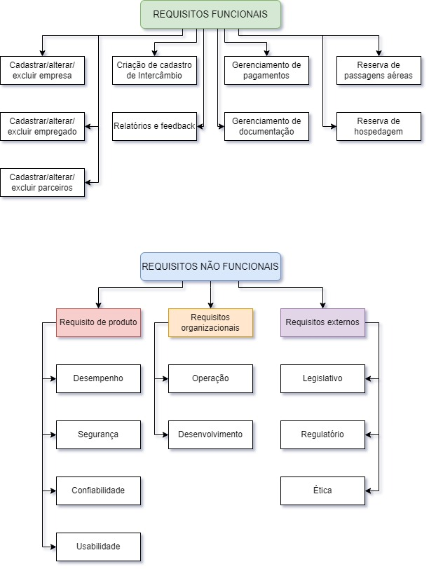

# INTERCÂMBIO CORPORATIVO 

  O negócio proposto pelo grupo consiste em otimizar o processo de Intercâmbio de um colaborador requisitado pela empresa, a fim de estudar, trabalhar e obter conhecimento em alguma outra filial ou parceira e adquirir novas tecnologias para o crescimento da empresa em questão.

## ➔ Descrição dos projetos:
   A empresa assumirá a responsabilidade de estabelecer contato com as diversas agências de viagem, hospedagem e turismo envolvidas no processo, com o objetivo de centralizar as negociações e simplificar as etapas a serem cumpridas pelo cliente. Desta forma, espera-se que o contratante precise apenas definir um único ponto para efetuar o pagamento e receber um cronograma consolidado, contendo todas as informações relevantes para a realização do intercâmbio.

## ➔ Fluxograma do projeto:
  

## ➔ Processos separados:

 ### 1) Processo de Pagamento
  
    
 ### 2) Processo de Feedback
  

 ### 3) Processo de Hospedagem
  

 ### 4) Processo de Turismo
  

 ### 5) Processo de Viagem
  

## ➔ Modelo de Software:

 Optamos por implementar o modelo ágil Extreme Programming (XP) devido a várias razões que se alinham perfeitamente com as necessidades e características deste tipo de iniciativa.

Primeiramente, o ambiente de intercâmbio corporativo é frequentemente dinâmico e sujeito a mudanças rápidas. O XP, com sua abordagem iterativa e incremental, nos permite adaptar rapidamente o desenvolvimento às novas demandas e feedbacks dos stakeholders. Isso é crucial, pois as necessidades das empresas e as condições do mercado podem mudar rapidamente, e precisamos ser ágeis para responder a essas mudanças.

Além disso, a ênfase do XP em comunicação constante e colaboração entre a equipe de desenvolvimento e os representantes da empresa contratante garante que os requisitos sejam compreendidos e atendidos de forma eficaz. A programação em par e a integração contínua promovem a troca de conhecimentos e a identificação precoce de problemas, resultando em um produto de alta qualidade que atende às expectativas do cliente.

Outro ponto importante é o desenvolvimento baseado em testes (TDD), que nos permite garantir a qualidade do software desde o início do projeto. Ao escrever testes antes do código, conseguimos minimizar regressões e garantir que cada funcionalidade esteja alinhada com os requisitos, aumentando a confiança no produto final.

Por fim, a filosofia do XP de priorizar simplicidade e design refatorado nos ajuda a manter o código limpo e fácil de entender, facilitando futuras manutenções e adaptações. Isso é essencial em um projeto que pode evoluir ao longo do tempo e que requer agilidade na implementação de novas funcionalidades.

Em resumo, a escolha do modelo ágil XP se justifica pela sua capacidade de promover flexibilidade, colaboração e qualidade, características fundamentais para o sucesso do nosso projeto de intercâmbio corporativo. 

## ➔ Stakeholders:

### 1) Stakeholders Internos:
**• Equipe de Desenvolvimento :** Os programadores e desenvolvedores responsáveis por criar o sistema ou plataforma de intercâmbio.
 
**• Gestores de Projetos:** Profissionais que supervisionam o andamento do projeto, garantindo que os prazos e objetivos sejam atendidos.

**• Departamentos de Marketing e Vendas:** Equipes que promovem o serviço de intercâmbio e se comunicam com os clientes. 

**• Equipe de Atendimento ao Cliente:** Profissionais que interagem diretamente com os usuários, resolvendo dúvidas e problemas.

### 2) Stakeholders Externos:
**• Clientes/Empresas Participantes:** Organizações que utilizam o serviço de intercâmbio e têm expectativas sobre suas funcionalidades e benefícios.
 
**• Fornecedores de Tecnologia:** Empresas que fornecem ferramentas, software ou infraestrutura necessária para o projeto.

**• Reguladores:** Entidades governamentais que impõem regulamentações sobre intercâmbio e comércio, assegurando conformidade legal.

**• Investidores:** Pessoas ou entidades que financiam o projeto e esperam retornos financeiros.

**• Parceiros Estratégicos:** Outras empresas ou organizações que colaboram no projeto, como agências de intercâmbio ou instituições educacionais. 

## ➔ Requisitos do negócio:
    
  

## ➔ Regras de negócio:

    1) Uma empresa só poderá ser cadastrada se houver CNPJ;
    2) Um funcionário só poderá ser cadastrado se houver CPF;
    3) O empregado só poderá ser aprovado para intercâmbio se tiver todos os documentos necessários para realizar uma viagem;
    4) A empresa só poderá requisitar um intercâmbio para um funcionário se ela obter uma conta bancária cadastrada;
    5) Um colaborador só pode ter um intercâmbio ativo por vez.
    6) O colaborador deve atender a requisitos mínimos de tempo de empresa para solicitar um intercâmbio.
    7) Os parceiros devem ser cadastrados e aprovados pela empresa.
    8) Os parceiros devem apresentar documentação comprobatória de suas atividades.
    9) O pacote deve incluir todos os serviços essenciais para o intercâmbio (passagem, hospedagem, seguro, etc.).
    10) As condições de cancelamento e reembolso devem ser definidas em contrato e comunicadas ao colaborador.
    11) Em caso de cancelamento por parte do colaborador, podem ser aplicadas penalidades.
    12) A data de início da viagem não pode ser anterior à data de aprovação do pacote.
    13) Todos os documentos necessários para a viagem devem ser enviados com antecedência.
    14) O sistema deve gerar um checklist de documentos para o colaborador.
    15) A pesquisa de satisfação deve ser enviada ao colaborador após o término do intercâmbio.
    16) Os resultados da pesquisa devem ser analisados e utilizados para aprimorar o processo de intercâmbio.
